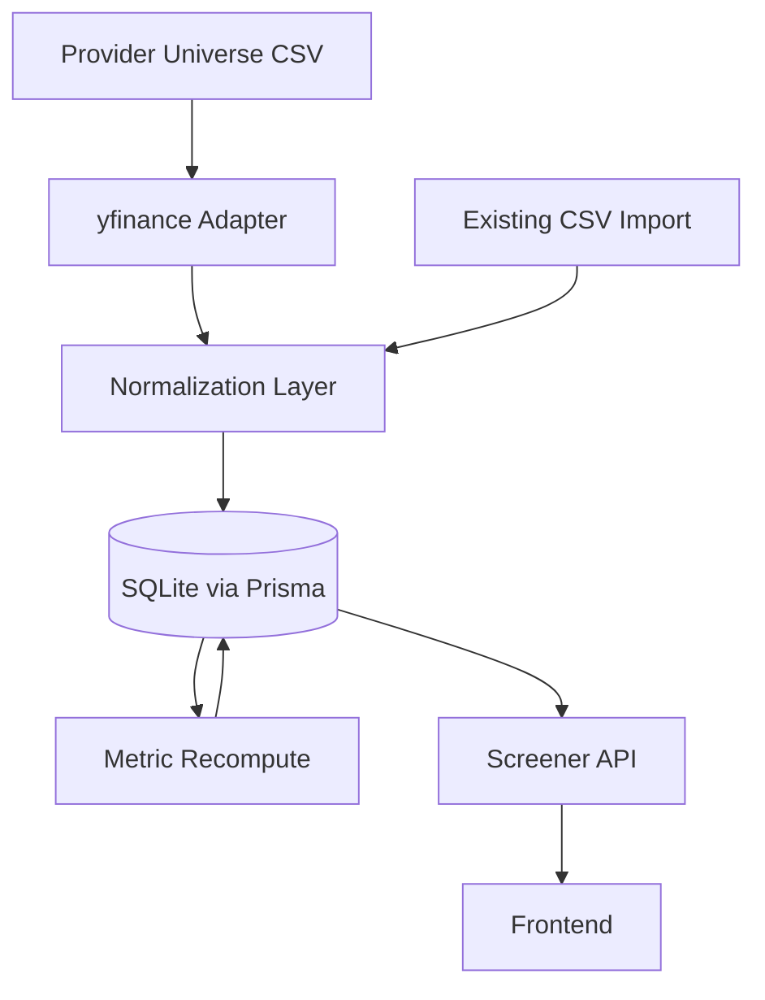

# Free Market Data Source Integration Design

Date: 2026-05-04

## Status

Approved direction for a personal/internal prototype. This document designs how
the app should connect to free market data sources for US and Singapore stocks
without changing the existing local data-hub architecture.

Related documents:

- `docs/superpowers/specs/2026-05-02-stock-screener-architecture-design.md`
- `docs/superpowers/specs/2026-05-02-stock-screener-data-sourcing-logistics-risks.md`
- `docs/superpowers/specs/2026-05-02-stock-screener-data-flow-design.md`

## Decision

Use a hybrid source strategy:

1. `yfinance` as the first live provider adapter for personal/internal
   prototype ingestion.
2. Existing CSV import as a first-class fallback and correction path.
3. Optional official API adapters later for spot checks or replacement.

The app should not call market data sources from the frontend. External data
must be imported by backend ingestion commands into the local database, then the
existing metric recomputation flow should produce screenable metrics.

## Source Comparison

### yfinance

Use as the first prototype source.

Strengths:

- No API key required.
- Works well for common US symbols such as `AAPL`, `MSFT`, and `NVDA`.
- Commonly supports Singapore Yahoo symbols such as `D05.SI`, `U11.SI`, and
  `Z74.SI`.
- Can provide historical prices, dividends, and some company/fundamental fields.
- Fits personal research and educational prototyping.

Risks:

- It is unofficial and can break if Yahoo changes behavior.
- Field coverage varies by ticker, especially for SGX fundamentals.
- Terms and licensing are not suitable to assume for public redistribution.

### Alpha Vantage

Keep as a possible official API adapter later.

Strengths:

- Official API with documented daily time series and fundamental endpoints.
- Free key available.
- Good for spot-checking selected symbols.

Risks:

- Free tier is limited to 25 requests per day.
- Full-universe ingestion is not practical on the free tier.
- SGX coverage and fundamentals need validation before depending on it.

### Twelve Data

Keep as a possible official API adapter later.

Strengths:

- Official API with reference data, time series, dividends, and fundamentals.
- Free Basic tier exists.
- Useful endpoint structure for provider-adapter testing.

Risks:

- Free plan market coverage and credits are limited.
- Fundamental endpoints consume more credits than simple price endpoints.
- The free tier is not enough for broad US plus SGX refreshes.

### EODHD

Keep as a likely paid/low-cost upgrade path rather than the first free source.

Strengths:

- Broad exchange coverage.
- Provides end-of-day data, fundamentals, splits, and dividends.
- Clear provider model for a future production adapter.

Risks:

- Free plan is limited to 20 calls per day.
- Free access does not appear sufficient for a practical US plus SGX screener.

### Marketstack

Keep as an end-of-day price source candidate only.

Strengths:

- Free tier includes end-of-day data and exchange/ticker metadata.
- Supports many exchanges.

Risks:

- Free tier request volume is very low for a screener.
- It does not solve the app's required annual fundamentals well.

## Architecture

The new provider work should extend the existing batch ingestion layer.



Boundaries:

- Provider adapters fetch source data and map it into internal normalized input
  shapes.
- Normalization writes to existing raw fact tables where possible.
- Metric recomputation remains responsible for ratios and screenable values.
- The frontend and screener API remain provider-agnostic.

## Provider Universe

The first ingestion flow should use curated symbol mapping files instead of
trying to ingest every US and SGX stock.

Example files:

- `data/provider-universe/us.csv`
- `data/provider-universe/sg.csv`

Example columns:

```csv
marketCode,exchange,stockCode,stockName,currency,providerSymbol
SGX,SGX,D05,DBS Group Holdings,SGD,D05.SI
US,NASDAQ,AAPL,Apple Inc,USD,AAPL
```

This keeps API usage bounded, makes results easier to inspect, and lets the
project encode provider-specific symbols without polluting user-facing stock
codes.

## Data Flow

The importer should run manually at first:

1. Read one or more provider universe CSV files.
2. Upsert markets and stocks.
3. Fetch daily OHLCV data for each `providerSymbol`.
4. Fetch available dividend data.
5. Fetch available company/fundamental fields.
6. Upsert normalized records into existing Prisma tables.
7. Record import status, provider, timestamp, and missing-field notes.
8. Run metric recomputation as a separate command.

The first implementation should support a small universe only. Full-market
coverage is out of scope for this design.

## Field Mapping

The adapter should attempt to populate these app fields:

- Daily prices: date, open, high, low, close, adjusted close, volume.
- Stock identity: market, exchange, stock code, stock name, currency,
  provider symbol, active status.
- Annual financials: revenue, profit before tax when available, profit after
  tax when available, EBITDA or EBITA-like field when available, total debt,
  total equity, shares outstanding, EPS, and book value per share.
- Dividends: dividend per share by fiscal year when available.
- Market cap: latest market capitalization when available.

Missing fields must be allowed. The app should store the available data and let
the existing data-quality rules mark incomplete derived metrics.

## Error Handling

Provider ingestion should distinguish these outcomes:

- Complete symbol import.
- Partial symbol import with missing fundamentals or dividends.
- Symbol not found.
- Provider request failure.
- Parse or normalization failure.

A partial import should not fail the whole run. It should record the issue and
continue with the next symbol.

## Testing

Implementation should include focused tests for:

- Universe CSV parsing and provider symbol mapping.
- Successful normalization of one US and one SGX stock.
- Missing fundamental fields producing incomplete metrics rather than crashes.
- Import run status for partial failures.
- Existing screener behavior after imported data is recomputed.

Network calls should be isolated behind an adapter boundary so unit tests can
use fixtures instead of live provider requests.

## Operational Notes

Manual commands are enough for the first version. A likely local workflow is:

```powershell
npm run import:yfinance
npm run metrics:recompute
```

The README should clearly state that this source path is for personal/internal
research prototypes, not financial advice and not public redistribution.

## Deferred Work

These items are intentionally outside the first implementation:

- Scheduled ingestion.
- Full US and SGX stock universes.
- Paid provider integration.
- Provider comparison dashboard.
- AI qualitative review.
- Public/commercial data licensing review.

## Sources Checked

- Alpha Vantage documentation and support pages.
- EODHD homepage, quick start, and pricing pages.
- Marketstack documentation and pricing pages.
- Twelve Data documentation and pricing pages.
- Finnhub public API materials.
- yfinance documentation and legal disclaimer.

The important conclusion is that no free official provider clearly covers the
full required US plus SGX price and fundamental dataset at practical screener
volume. For a personal/internal prototype, `yfinance` plus the existing CSV
fallback is the most pragmatic first adapter.
